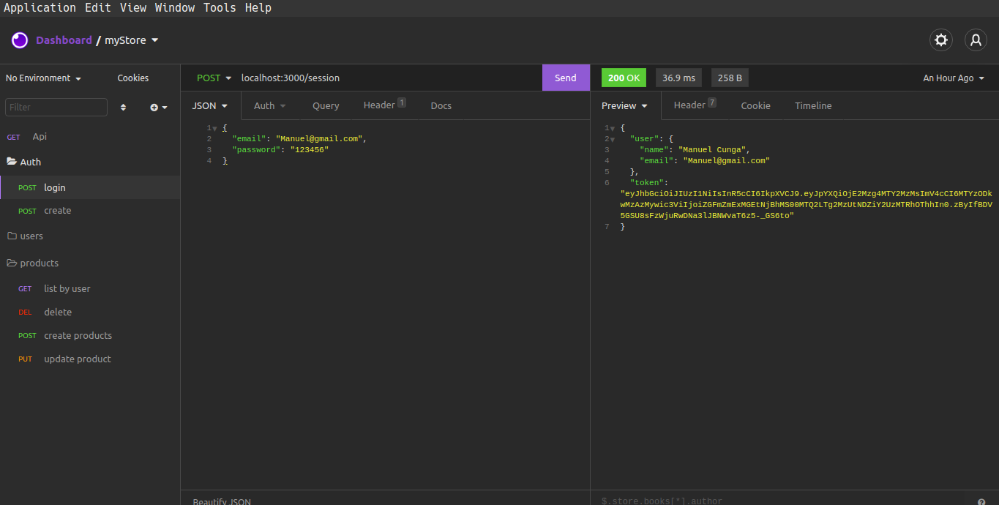

# My Store Simple API


 <h1 align = center>
    
</h1>


 <h1 align = center>
    
</h1>

## Description
  - This is a simpli store api, that I Build to learn about Designe Patterns S.O.L.I.D


## Features
* Register
* Login
* User Profile
* Add Product
* List product by user
* Delete product
* Update product


 <h1 align = center>
    
</h1>

## Tech
* JWT
* Postgres
* Typeorm
* Tyscript
* Docker
* tsyringe

## Designer Patterns
* S.O.L.ID
* Singliton


## Installation
### To run the app with Node.js and postgres

1. Run `npm install`.

Wait for the build process to complete

1. Run `npm run dev` to start the api server


## Build the app
* Build manually
```
 $ npm start
```
Or
* Build with Docker Compose

```
$ docker-compose build
$ docker-compose up
```
